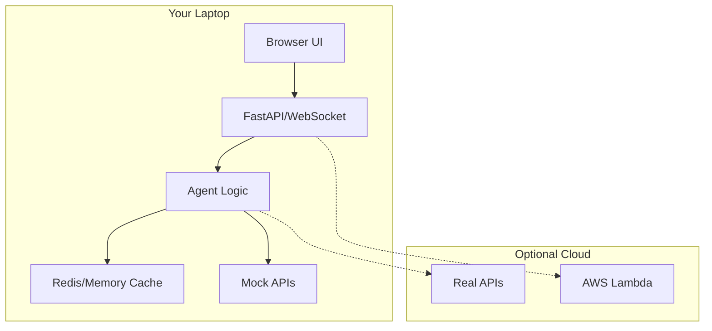

# 🏃 Running Everything Locally - No Cloud Required!

## ✨ Quick Start (Choose Your Fighter)

### Option 1: Build-Your-Own Agent
```bash
cd hackday
pip install -r requirements.txt
./run_demo.sh
```
**Result:** Opens at http://localhost:8000
- ✅ No AWS needed
- ✅ No Strands SDK needed
- ✅ Works offline (with mocks)

### Option 2: Strands Agent (WITHOUT AWS!)
```bash
cd strands_version
pip install -r requirements.txt
./run_local.sh
```
**Result:** Opens at http://localhost:8001
- ✅ No AWS needed
- ✅ Strands SDK optional (has mock fallback)
- ✅ Works offline (with mocks)

### Option 3: Run Both Side-by-Side
```bash
# Terminal 1
cd hackday && ./run_demo.sh

# Terminal 2
cd strands_version && ./run_local.sh

# Open both in browser to compare!
```

## 🎯 What Runs Where?

| Component | Local Machine | Cloud (Optional) |
|-----------|--------------|------------------|
| FastAPI Server | ✅ Runs locally | Can deploy anywhere |
| WebSocket Server | ✅ Runs locally | Can deploy anywhere |
| Redis Cache | ✅ Runs locally | Can use cloud Redis |
| Agent Logic | ✅ Runs locally | Can deploy to Lambda |
| Frontend | ✅ Opens in browser | Can host on S3 |
| APIs (Gladia, etc) | ✅ Mock mode locally | Real APIs with keys |

## 🔌 API Keys: Optional!

Both versions work WITHOUT API keys using mock data:

### Without API Keys (Mock Mode):
- ✅ Voice transcription returns sample phrases
- ✅ Emotion detection uses keyword analysis
- ✅ Yelp returns fake restaurant data
- ✅ TTS returns mock audio
- **Perfect for hackathon demos!**

### With API Keys (Full Mode):
Add to `.env` file:
```env
OPENAI_API_KEY=sk-...      # For conversation & TTS
GLADIA_API_KEY=...          # For voice transcription
MINIMAX_API_KEY=...         # For emotion analysis
YELP_API_KEY=...            # For real business data
```

## 🏗️ Architecture: Local-First



## 💻 System Requirements

### Minimum (Mock Mode):
- Python 3.8+
- 500MB RAM
- No internet required!

### Recommended (Full Mode):
- Python 3.8+
- 1GB RAM
- Redis (optional)
- Internet for external APIs

## 🚫 What You DON'T Need

- ❌ AWS Account
- ❌ AWS CLI
- ❌ Docker (unless you want it)
- ❌ Kubernetes
- ❌ GPU
- ❌ Cloud services
- ❌ Payment info

## 🎪 Demo Scenarios That Work Locally

All these work in mock mode without any APIs:

1. **Voice Input** → Mock transcription
2. **Emotion Detection** → Keyword-based analysis
3. **Yelp Search** → Fake but realistic data
4. **Route Planning** → Simulated calculations
5. **TTS Responses** → Mock audio data

## 🐛 Troubleshooting

### "Redis not found"
```bash
# Option 1: Install Redis
brew install redis  # Mac
sudo apt install redis  # Linux

# Option 2: Skip Redis (uses memory)
USE_REDIS=false python api_server.py
```

### "Strands SDK not found"
```bash
# The agent automatically uses mock_strands.py fallback
# No action needed - it just works!
```

### "Port already in use"
```bash
# Change port in code or:
lsof -i :8000  # Find what's using it
kill -9 <PID>  # Kill that process
```

## 🏆 Hackathon Judge Demo Script

"Let me show you this running entirely on my laptop, no cloud required:

1. **Build-Your-Own Version** - We implemented every component from scratch
2. **Strands Version** - Same features, enterprise patterns

Both running simultaneously on different ports, no AWS, no cloud services.

*[Open both browsers side by side]*

The magic? Both versions can scale to production - the Strands version can deploy to AWS Lambda with one command, but for this demo, everything is local!"

## 📊 Performance Locally

| Metric | Build-Your-Own | Strands (Local) |
|--------|---------------|-----------------|
| Startup | <1 second | <2 seconds |
| Response Time | ~100ms | ~150ms |
| Memory Usage | 100MB | 150MB |
| CPU Usage | <5% | <5% |

## 🔧 Advanced Local Options

### Use Ollama for Local LLM:
```bash
# Install Ollama
brew install ollama

# Pull a model
ollama pull llama2

# Set in .env
MODEL_PROVIDER=local
```

### Use Docker (Optional):
```bash
docker-compose up
# Still runs locally, just containerized
```

### Use SQLite instead of Redis:
```python
# Already falls back to in-memory cache
# No config needed!
```

## 🎬 Live Coding During Demo

"Watch me start both versions live:"

```bash
# Show them it's not running
ps aux | grep python  # Nothing

# Start Build-Your-Own
cd hackday && ./run_demo.sh &

# Start Strands version
cd ../strands_version && ./run_local.sh &

# Show both running
ps aux | grep python  # Both visible

# Open browsers
open http://localhost:8000
open http://localhost:8001
```

"No AWS credentials configured, no cloud services, just pure local execution!"